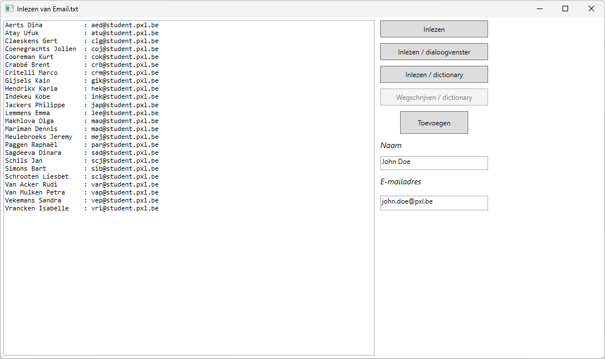

# EmailBestand

Lees uit het tekstbestand *Email.txt* de namen en de e-mailadressen en toon deze in een TextBox. Voorzie een gestructureerde foutafhandeling wanneer het bestand niet gevonden kan worden en wanneer er zich een onverwachte fout kan voordoen.



-   De opdrachtknop **Inlezen** leest het bestand in een StringBuilder en drukt het af in het linker tekstvak *resultTextBox*. Gebruik hiervoor de functie *StringBuilder InlezenBestand(string bestandsnaam).*
-   De opdrachtknop ***Inlezen/Dialoogvenster*** maakt gebruik van OpenFileDialog om het juiste bestand te openen om in te lezen met de functie *InlezenBestand()*.


-   Met de opdrachtknop *Inlezen/Dictionary* wordt het bestand ingelezen in een dictionary *Dictionary\<string, string\> dictGeg* en afgedrukt in resultTextBox.
-   De opdrachtknop *Wegschrijven / Dictionary* gebruikt de dictionary *dictGeg* om de e-mailadressen weg te schrijven naar een nieuw bestand *Adressen.txt*.
-   De opdrachtknop *Toevoegen* zorgt ervoor dat de ingevoerde gegevens toegevoegd worden aan het bestand *Email.txt*. Gebruik hier een SaveFileDialog voor.


## XAML
```
<Grid>
    <Grid.ColumnDefinitions>
        <ColumnDefinition Width="2*"/>
        <ColumnDefinition Width="200"/>
        <ColumnDefinition Width="200"/>
    </Grid.ColumnDefinitions>
    <TextBox x:Name="resultTextBox" Grid.Column="0" Margin="5" TextWrapping="Wrap" FontFamily="Consolas"/>
    <StackPanel Grid.Column="1" Margin="5" >
        <Button x:Name="readFileButton" Content="Inlezen" Margin="0 0 0 10" Height="30" Click="readFileButton_Click"/>
        <Button x:Name="readDialogButton" Content="Inlezen / dialoogvenster"  Margin="0 0 0 10" Height="30" Click="readDialogButton_Click"/>
        <Button x:Name="readDictionaryButton" Content="Inlezen / dictionary"  Margin="0 0 0 10" Height="30" Click="readDictionaryButton_Click"/>
        <Button x:Name="writeButton" Content="Wegschrijven / dictionary"  Margin="0 0 0 10" Height="30" IsEnabled="False" Click="writeButton_Click"/>
        <Button x:Name="addButton" Content="Toevoegen" Margin="0 0 0 10" Width="120" Height="40" Click="addButton_Click"/>
        <TextBlock Height="19" Text="Naam" Margin="0 0 0 10" FontStyle="Italic" FontSize="14"/>
        <TextBox x:Name="nameTextBox" Height="25" Margin="0 0 0 10" Text="John Doe"/>
        <TextBlock Height="25" Text="E-mailadres" Margin="0 0 0 10" FontStyle="Italic" FontSize="14"/>
        <TextBox x:Name="emailTextBox" Height="26" Margin="0 0 0 10" Text="john.doe@pxl.be"/>
    </StackPanel>
</Grid>
```
